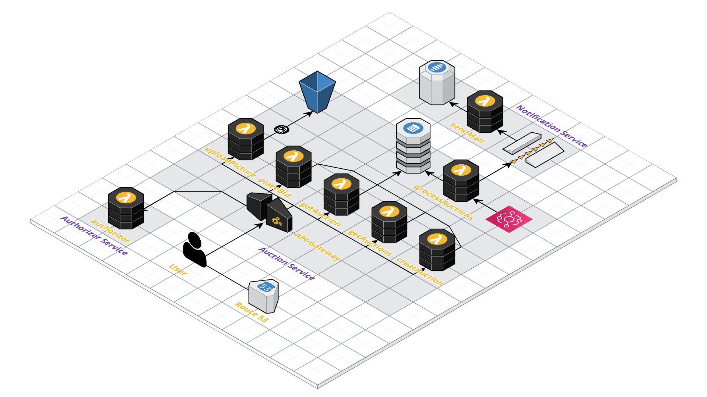

# Serverless Auction

Implementation of an online auction application using AWS and Serverless Framework with TypeScript.

## Code style

[](https://github.com/feross/standard)

## Tech/framework used

<b>Built with</b>

- [Serverless Framework](https://www.serverless.com)
- [Amazon Web Services](https://aws.amazon.com/)
- [TypeScript](https://www.typescriptlang.org/)
- [Jest](https://jestjs.io/)

## Features

API endpoing implemented as Lambda services to add, update and retrieve auction items

## Installation

Ensure you have AWS credentials installed on the local development machine

```
# Under ~/.aws a credentials file similar to this (serverless-admin is an account created in IAM for this example). Replace the keys with your own examples.

[default]
aws_access_key_id=<YOUR-ACCESS-KEY>
aws_secret_access_key=<YOUR-SECRET-ACCESS-KEY>

[serverless-admin]
aws_access_key_id=YOUR-ACCESS-KEY>
aws_secret_access_key=<YOUR-SECRET-ACCESS-KEY>
```

Install Serverless Framwork globally

```
npm install -g serverless
```

Deploy the services to AWS using Serverless Framework

```
npm run deploy

```

## Development endpoints

Sucessfull deployment should display the available endpoints & functions

| Service          | Function        | Local endpoint                                                                      |
| ---------------- | --------------- | ----------------------------------------------------------------------------------- |
| Create Auction   | createAuction   | POST - https://l3dy4zqr25.execute-api.eu-west-1.amazonaws.com/dev/auction           |
| Get Auction      | getAuctions     | GET - https://l3dy4zqr25.execute-api.eu-west-1.amazonaws.com/dev/auctions           |
| Get All Auctions | getAuction      | GET - https://l3dy4zqr25.execute-api.eu-west-1.amazonaws.com/dev/auction/{id}       |
| Place Bid        | placeBid        | PATCH - https://l3dy4zqr25.execute-api.eu-west-1.amazonaws.com/dev/auction/{id}/bid |
| Process Auctions | processAuctions | N/A                                                                                 |

## How to use

Using the endpoints with tools such as [Postman](https://www.postman.com/) or [Insomnia](https://insomnia.rest/)

### Create auction

```
/auction

# body (JSON)
{
    "title": "Test Auction"
}
```

### Get auction by ID

```
/auction/{auction_id}
```

### Get auctions by status (open or closed)

```
/auctions/status=open

/auctions/status=closed
```

### Place bid by auction ID

```
/auction/{auction_id}/bid

# body (JSON)
{
    "amount": "42"
}
```

## Tests

Running unit tests

```
npm run test
```

Running unit tests with code coverage

```
npm run test:ci
```

Run linting on the project files

```
npm run lint
```

## Deployment

Deploy the full application stack to AWS

```
npm run deploy
```

Deploy a single lambda function to AWS

```
# Deploy the getAuctions function/handler to AWS

FUNCTION=getAuctions npm run deploy-fn
```

Run a function/handler remotely on AWS invoking local mock events

```
# Invoke the getAuctions function/handler remotely with local mock events

FUNCTION=getAuctions npm run mock-fn
```

Run a function/handler locally invoking local mock events

```
# Invoke the getAuctions function/handler locally with local mock events

FUNCTION=getAuctions npm run mock-fn-local
```

Tail the logs of a remote AWS function/handler

```
# Tail the remote AWS Cloudwatch logs for the getAuctions function/handler

FUNCTION=getAuctions npm run tail-fn
```

## Blueprint

Overview diagram of Serverless Auction AWS cloud architecture

<p align="left">
  
</p>

## License

Massachusetts Institute of Technology licence

MIT © [S Bradshaw]()
